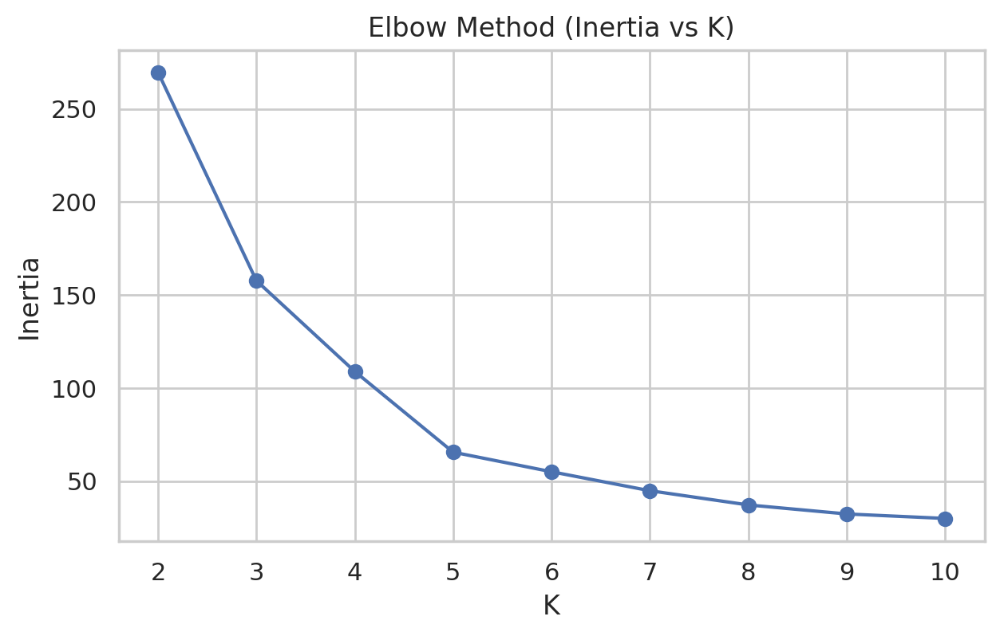
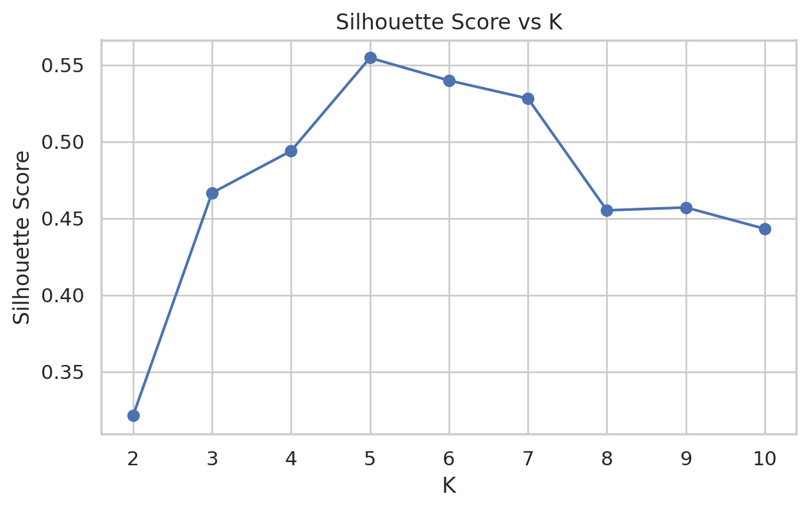
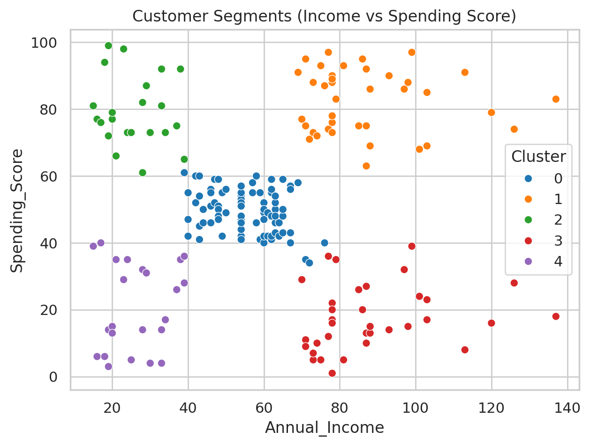
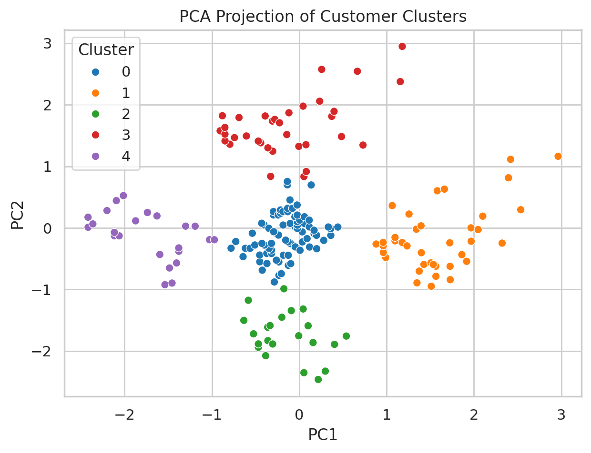

# Customer Segmentation System (K-Means + Silhouette + PCA)

An end-to-end **customer segmentation** project using the *Mall Customers* dataset. The workflow follows a practical analytics pipeline:

**EDA → Feature Scaling → K Selection (Elbow + Silhouette) → K-Means Clustering → Segment Visualization (2D + PCA) → Export Segmented Dataset**

This project is built to be **resume/portfolio-ready** with clear visuals, interpretable segments, and reproducible steps.

---

## Why this project matters

Customer segmentation helps businesses:
- design **targeted marketing campaigns**
- improve **customer retention**
- personalize **offers and recommendations**
- allocate budget toward **high-value segments**

Instead of treating all customers the same, segmentation helps identify *behavioral clusters* based on income and spending.

---

## Dataset

- File: `Mall_Customers.csv`
- Key fields used for clustering:
  - `Annual Income (k$)`
  - `Spending Score (1-100)`
- Additional fields for profiling:
  - `Age`
  - `Gender`

---

## Approach

### 1) Feature Engineering + Scaling
- Selected features: **Annual Income** and **Spending Score**
- Applied **StandardScaler** to prevent clustering bias due to scale differences.

### 2) Choosing Optimal K
We used two standard methods to choose the number of clusters:

- **Elbow Method (Inertia vs K)** → looks for the point where improvement slows
- **Silhouette Score vs K** → measures cluster separation quality

✅ From the silhouette curve, the best separation occurs at **K = 5** (peak score).

### 3) Clustering + Visualization
- Trained **K-Means** with selected K
- Visualized clusters:
  - in original feature space (Income vs Spending)
  - in **PCA 2D projection** (to validate separation in reduced dimensions)

### 4) Segment Profiling + Export
- Added cluster labels to each customer
- Exported final result as: **`segmented_customers.csv`**

---

## Results Preview (Saved Plots)

### Elbow Method (Inertia vs K)
Helps identify diminishing returns as K increases.


### Silhouette Score vs K
Peak silhouette indicates best cluster separation (**K = 5**).


### Customer Segments (Income vs Spending Score)
Clear segmentation of customers across spending behavior and income levels.


### PCA Projection of Customer Clusters
PCA confirms clusters remain separable in reduced dimensions.


---

## Segment Interpretation (Business-Ready)

Once clusters are formed, interpret them using cluster centers + profile table. Typical segment meanings:

- **High income + high spending** → premium customers (retain, VIP offers)
- **High income + low spending** → upsell potential (personalized recommendations)
- **Low income + high spending** → deal-driven buyers (discount campaigns)
- **Low income + low spending** → low engagement (reactivation strategy)
- **Mid income + mid spending** → stable customers (loyalty programs)

> Final labels depend on the actual cluster centers computed in your run.

---

## How to Run

### 1) Install dependencies
```bash
pip install -r requirements.txt
